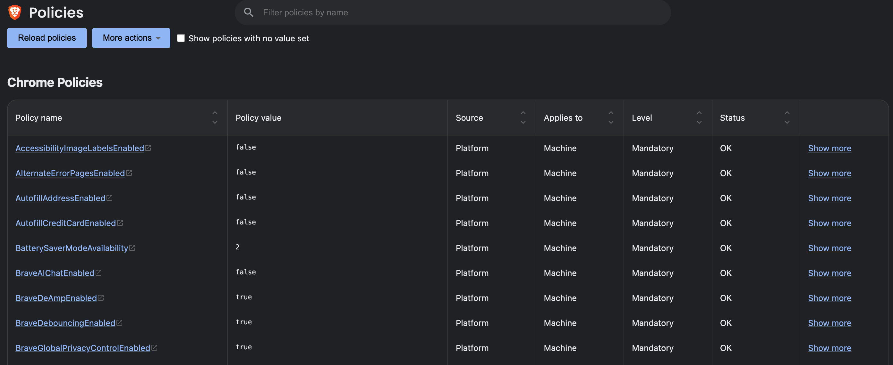

# 🦁 Brave Free Origin for macOS

A macOS shell-based policy manager for turning Brave Browser into a leaner, quieter, privacy-focused browser by disabling Brave AI, Rewards, Wallet, VPN, News, Talk, telemetry, usage ping, Web Discovery, the built-in password manager, autofill, and selected Chromium background/reporting features.



This project is an **unofficial macOS companion** inspired by [TahaHydra/Brave-Free-Origin](https://github.com/TahaHydra/Brave-Free-Origin), which provides a Windows GUI implementation using PowerShell and Windows Registry policies.

This repository is **not a forked Windows GUI port**. It uses macOS Managed Preferences:

```text
/Library/Managed Preferences/com.brave.Browser.plist
```

You can verify applied policies in Brave:

```text
brave://policy
```

---

## ✨ Why this exists

Brave is more privacy-focused than Chrome by default, but it still includes many built-in features that some users may not want:

- Brave Leo / AI Chat
- Brave Rewards / BAT
- Brave Wallet
- Brave VPN
- Brave News
- Brave Talk
- Usage ping
- P3A product analytics
- Web Discovery
- Built-in password manager
- Autofill
- Chromium reporting and background services

This script applies Brave and Chromium enterprise policies locally on macOS to reduce those features in a repeatable, auditable, and reversible way.

---

## ✅ What this script does

The default mode applies a full recommended policy set.

It disables or restricts:

- Brave Leo / AI Chat
- Brave Rewards
- Brave Wallet
- Brave VPN
- Brave News
- Brave Talk
- Brave Tor window
- Brave P3A
- Brave stats / usage ping
- Brave Web Discovery
- Chromium metrics reporting
- URL keyed anonymized data collection
- Brave built-in password manager
- password leak detection
- address autofill
- credit-card autofill
- payment method queries
- search suggestions
- cloud spellcheck
- alternate error pages
- built-in translation
- Safe Browsing extended reporting
- Safe Browsing deep scanning
- Safe Browsing surveys
- Browser Labs
- Live Caption
- automatic image labels
- new tab custom background
- Chrome / Chromium GenAI features
- Chrome Variations / field trials

It enables or enforces:

- Brave adblock
- fingerprinting protection
- referrer protection
- tracking query parameter filtering
- De-AMP
- redirect debouncing
- Global Privacy Control
- reduced language fingerprinting
- Safe Browsing Standard protection
- high efficiency / memory saver
- hardware acceleration
- automatic DNS-over-HTTPS mode
- QUIC

---

## 🚀 Quick start

Clone the repository:

```bash
git clone https://github.com/<your-username>/brave-free-origin-macos.git
cd brave-free-origin-macos
```

Make the script executable:

```bash
chmod +x brave-macos-policy.sh
```

Apply the default policy set:

```bash
./brave-macos-policy.sh
```

Or explicitly:

```bash
./brave-macos-policy.sh --default
```

Then open Brave and go to:

```text
brave://policy
```

Click:

```text
Reload policies
```

---

## 🧭 Modes

### 1. Default mode

Applies the full recommended policy set.

```bash
./brave-macos-policy.sh
```

Equivalent:

```bash
./brave-macos-policy.sh --default
```

This is the recommended mode if you want a clean Brave setup with Brave commercial features, telemetry, usage ping, Web Discovery, password manager, autofill, and selected Chromium reporting features disabled.

---

### 2. Interactive mode

Lets you choose which policy groups to apply.

```bash
./brave-macos-policy.sh --interactive
```

You can select multiple groups by entering numbers separated by spaces:

```text
1 2 3 6
```

Or apply all groups:

```text
all
```

Use this mode if you want to keep specific features such as translation or Brave autofill.

---

### 3. Restore mode

Removes all policy keys managed by this script.

```bash
./brave-macos-policy.sh --restore
```

Then open:

```text
brave://policy
```

Click:

```text
Reload policies
```

If policies still appear, restart Brave or run:

```bash
killall cfprefsd 2>/dev/null || true
```

---

### 4. Dry run

Preview actions without writing to the plist:

```bash
./brave-macos-policy.sh --interactive --dry-run
```

---

### 5. No restart

Apply policies without restarting Brave:

```bash
./brave-macos-policy.sh --default --no-restart
```

---

## 🧩 Policy groups

### 1. Brave feature debloat

Disables:

- Brave Leo / AI Chat
- Brave Rewards
- Brave Wallet
- Brave VPN
- Brave News
- Brave Talk
- Brave Tor window

Policies:

```text
BraveAIChatEnabled = false
BraveRewardsDisabled = true
BraveWalletDisabled = true
BraveVPNDisabled = true
BraveNewsDisabled = true
BraveTalkDisabled = true
TorDisabled = true
```

---

### 2. Telemetry and reporting shutdown

Disables:

- Brave P3A product analytics
- Brave stats / usage ping
- Chromium metrics reporting
- Brave Web Discovery
- URL keyed anonymized data collection
- user feedback submission
- WebRTC event log collection

Policies:

```text
BraveP3AEnabled = false
BraveStatsPingEnabled = false
MetricsReportingEnabled = false
BraveWebDiscoveryEnabled = false
UrlKeyedAnonymizedDataCollectionEnabled = false
UserFeedbackAllowed = false
WebRtcEventLogCollectionAllowed = false
```

---

### 3. Brave Shields and privacy protections

Enables or enforces:

- Brave adblock
- fingerprinting protection
- referrer protection
- tracking query parameter filtering
- De-AMP
- redirect debouncing
- Global Privacy Control
- reduced language fingerprinting

Policies:

```text
DefaultBraveAdblockSetting = 2
DefaultBraveFingerprintingV2Setting = 3
DefaultBraveReferrersSetting = 2
BraveTrackingQueryParametersFilteringEnabled = true
BraveDeAmpEnabled = true
BraveDebouncingEnabled = true
BraveGlobalPrivacyControlEnabled = true
BraveReduceLanguageEnabled = true
```

---

### 4. Password manager, autofill, and payments shutdown

Disables Brave’s built-in:

- password manager
- password leak detection
- address autofill
- credit-card autofill
- payment method queries
- saved password import
- autofill form data import
- history import

Policies:

```text
PasswordManagerEnabled = false
PasswordLeakDetectionEnabled = false
AutofillAddressEnabled = false
AutofillCreditCardEnabled = false
PaymentMethodQueryEnabled = false
ImportSavedPasswords = false
ImportAutofillFormData = false
ImportHistory = false
```

Recommended alternatives:

- iCloud Passwords / iCloud Keychain
- 1Password
- Bitwarden
- Proton Pass

---

### 5. Search suggestions, spelling, error pages, and translation shutdown

Disables:

- search suggestions
- cloud spellcheck
- alternate error pages
- built-in translation

Policies:

```text
SearchSuggestEnabled = false
SpellCheckServiceEnabled = false
AlternateErrorPagesEnabled = false
TranslateEnabled = false
```

If you want to keep translation, use interactive mode and skip group `5`.

To remove only the translation policy later:

```bash
PLIST="/Library/Managed Preferences/com.brave.Browser.plist"

sudo /usr/libexec/PlistBuddy -c "Delete :TranslateEnabled" "$PLIST" 2>/dev/null || true
defaults delete com.brave.Browser TranslateEnabled 2>/dev/null || true

killall "Brave Browser" 2>/dev/null || true
killall cfprefsd 2>/dev/null || true
open -a "Brave Browser"
```

---

### 6. Safe Browsing standard mode

Keeps Safe Browsing Standard protection, but disables extra reporting, scanning, and surveys.

Policies:

```text
SafeBrowsingProtectionLevel = 1
SafeBrowsingExtendedReportingEnabled = false
SafeBrowsingDeepScanningEnabled = false
SafeBrowsingSurveysEnabled = false
```

This keeps basic malicious-site protection enabled while reducing additional reporting.

---

### 7. DNS and network behavior

Policies:

```text
DnsOverHttpsMode = automatic
NetworkPredictionOptions = 2
QuicAllowed = true
```

This keeps DNS-over-HTTPS in automatic mode.

It does not force Cloudflare, Quad9, Google DNS, or NextDNS.

---

### 8. Performance and UI cleanup

Enables:

- high efficiency / memory saver
- hardware acceleration
- battery saver availability

Disables:

- Browser Labs
- Live Caption
- automatic image labels
- new tab custom background
- default browser prompt

Policies:

```text
HighEfficiencyModeEnabled = true
BatterySaverModeAvailability = 2
HardwareAccelerationModeEnabled = true
DiskCacheSize = 262144000
BrowserLabsEnabled = false
LiveCaptionEnabled = false
AccessibilityImageLabelsEnabled = false
NTPCustomBackgroundEnabled = false
DefaultBrowserSettingEnabled = false
```

---

### 9. Chromium / Chrome GenAI shutdown

Disables:

- AI theme generation
- DevTools GenAI
- Help Me Write
- AI history search

Policies:

```text
CreateThemesSettings = 2
DevToolsGenAiSettings = 2
HelpMeWriteSettings = 2
HistorySearchSettings = 2
```

---

### 10. Chrome Variations restriction

Restricts Chrome Variations / field trials.

Policy:

```text
ChromeVariations = 2
```

---

## 🛠 Manual settings worth checking

Some Brave settings are better adjusted manually because policy behavior can vary by Brave version or may affect compatibility.

### WebRTC IP handling

Recommended:

```text
brave://settings/privacy
→ WebRTC IP handling policy
→ Disable non-proxied UDP
```

If Google Meet, Microsoft Teams, Zoom Web, or other WebRTC apps break, loosen this setting.

---

### Google push messaging

Recommended if you do not rely on web push notifications:

```text
brave://settings/privacy
→ Use Google services for push messaging
→ Off
```

---

### Translation

Default mode disables translation.

If you want to keep translation, use interactive mode and skip group `5`.

---

## 🚫 What this script intentionally does not do

This script does not:

- modify `/etc/hosts`
- block Brave domains at the DNS level
- edit Brave profile files
- edit Brave Local State
- install or remove extensions
- disable Brave updates
- disable macOS system services
- modify firewall rules
- install launch agents or daemons

It only writes Brave / Chromium policy keys to macOS Managed Preferences.

---

## 🔍 Verify applied policies

Open Brave:

```text
brave://policy
```

Click:

```text
Reload policies
```

Expected result:

```text
Status = OK
Source = Platform
Level = Mandatory
```

If you see `Error`, `Ignored`, or `Deprecated`, the policy may not be supported by your Brave version.

---

## 🏢 Why Brave shows “Managed by your organization”

When local enterprise policies are applied, Brave may display:

```text
Managed by your organization
```

This is expected.

It does not mean your Mac is controlled by a company. It only means Brave is reading locally applied enterprise policies.

---

## 🔗 Relationship to Brave-Free-Origin

This project was inspired by [TahaHydra/Brave-Free-Origin](https://github.com/TahaHydra/Brave-Free-Origin).

Brave-Free-Origin is a Windows GUI tool that applies Brave enterprise policies through the Windows Registry.

This repository provides a separate macOS implementation using shell scripts and macOS Managed Preferences.

It does not reuse the Windows GUI, PowerShell implementation, registry logic, hosts-file handling, scheduled-task handling, or scriptlet manager from the original project.

Credit goes to the original project for the general idea of using Brave enterprise policies to create a local, free, debloated Brave setup.

---

## ⚠️ Disclaimer

This project is unofficial.

It is not affiliated with:

- Brave Software
- Google
- Apple
- TahaHydra/Brave-Free-Origin

Use at your own risk.

Enterprise policies can change browser behavior, disable features, or create compatibility issues with some websites and workflows.

Review the script before running it.

---

## 📄 License

MIT
